# HOSPITAL-MANAGEMENT-SYSTEM :star_struck: :boy: :girl: :notebook: :open_file_folder: :computer:
 

<br>

***This 'Hospital Management System' using JDBC is created by Ankita Sikder and Biswarup Bhattacharjee, students of BTECH, in University of Engineering and Management, Kolkata.***

**Email Id: ankita.sikder14@gmail.com.** 

**Contact No: 8583939774.** 

<p align="left">
<a href="https://facebook.com/biswarup.bhattacharjee.5811" target="blank"></a>
<a href="https://instagram.com/biswarup2210" target="blank"></a>
<a href="https://github.com/biswa2210/biswa2210" target="blank"></a>
</p>

## About :point_down:

<div align="justified">
     

</div>

## Purpose :point_down:

<div align="justified">
     

</div>

## Use :point_down:

<div align="justified">
     

</div>

## Applications :point_down:

<div align="justified">
     

</div>


## Folder Structure :point_down:

```bash
HOSPITAL-MANAGEMENT-SYSTEM
     └── my hospital.c
```                       

## Making :point_down:

<div align="justified">

I have made this project using C language and file handling using C.
</div>

## Screenshots :point_down: 

<div align="center">
 
<a href="pics/h1.png">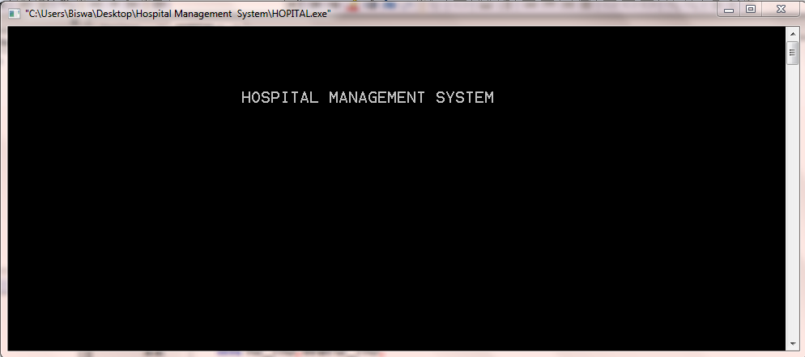</a> 
     
<a href="pics/h2.png">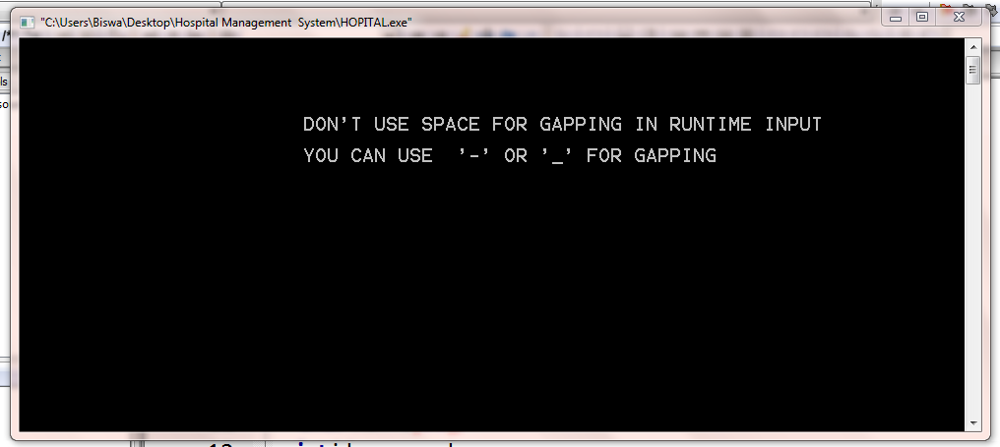</a>

<a href="pics/h3.png">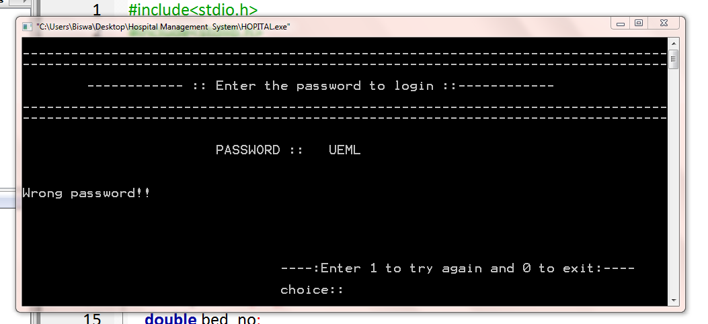</a> 
     
<a href="pics/h4.png">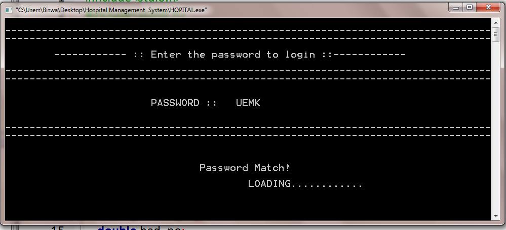</a>

<a href="pics/h5.png">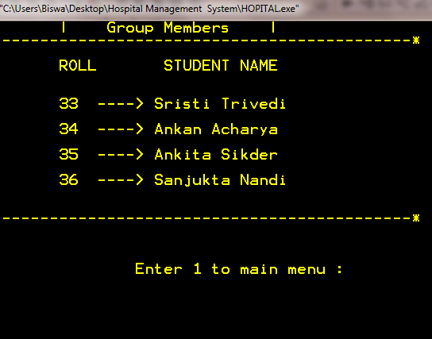</a> 
     
<a href="pics/h6.png">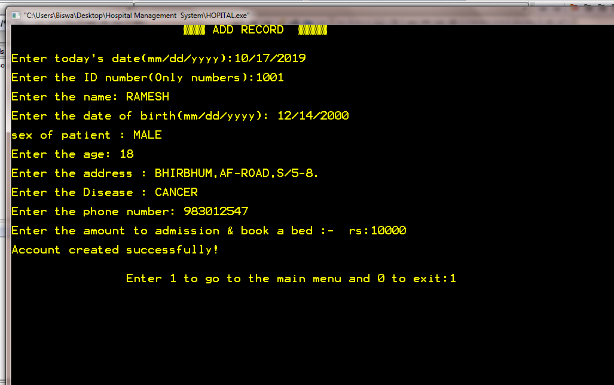</a>

<a href="pics/h7.png">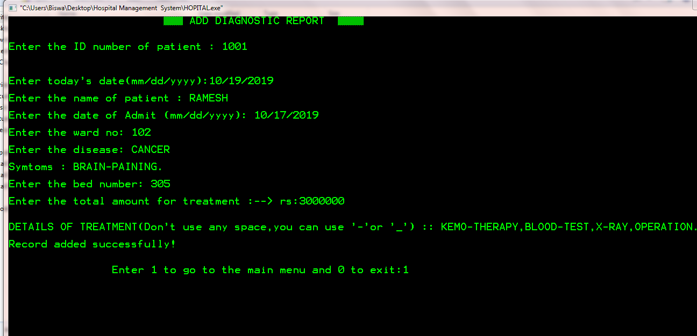</a> 
     
<a href="pics/h8.png">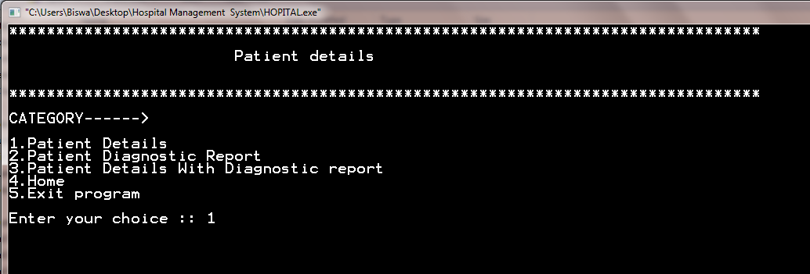</a>

<a href="pics/h9.png">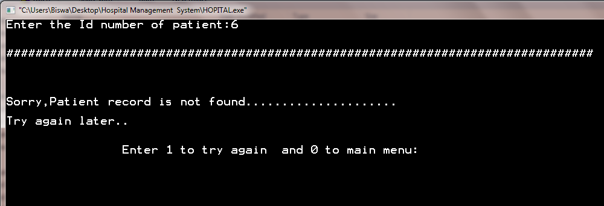</a> 
     
<a href="pics/h10.png">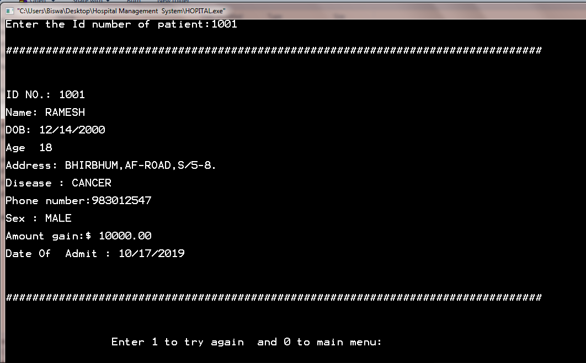</a>

<a href="pics/h11.png">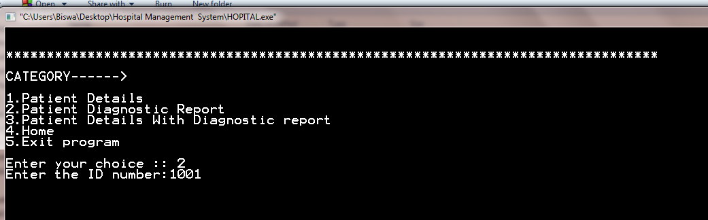</a> 
     
<a href="pics/h12.png">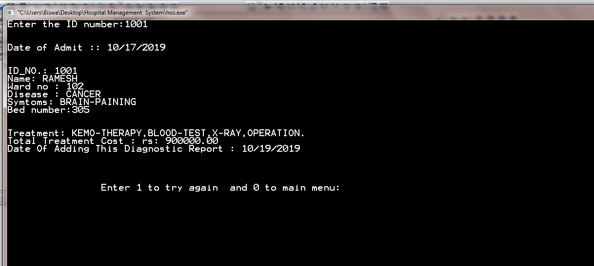</a>

<a href="pics/h13.png">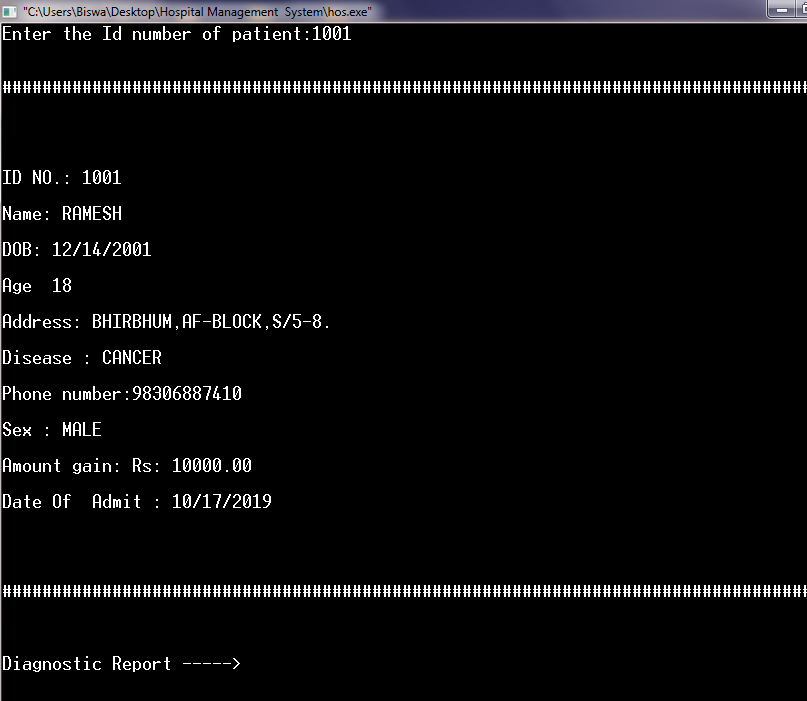</a> 
     
<a href="pics/h14.png"></a>

<a href="pics/h15.png"></a> 
     
<a href="pics/h16.png">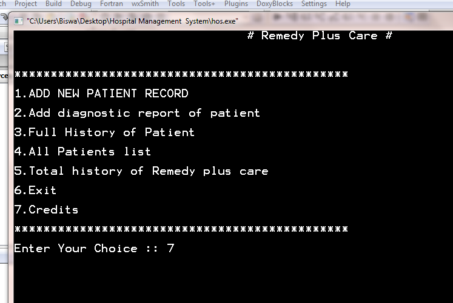</a>

<a href="pics/h17.png">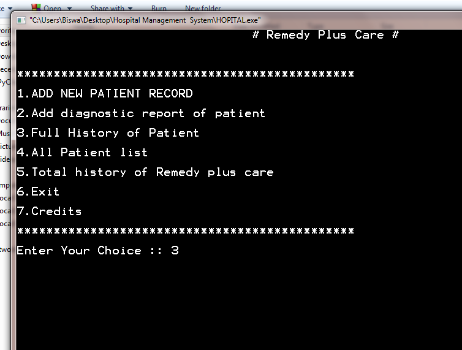</a> 
     
<a href="pics/h18.png">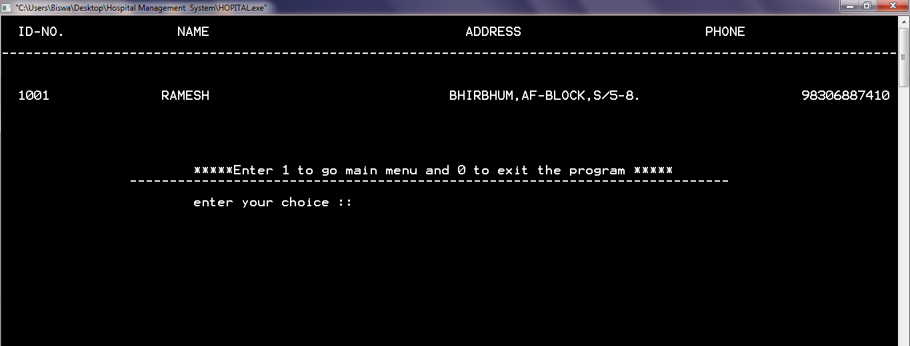</a>

<a href="pics/h19.png">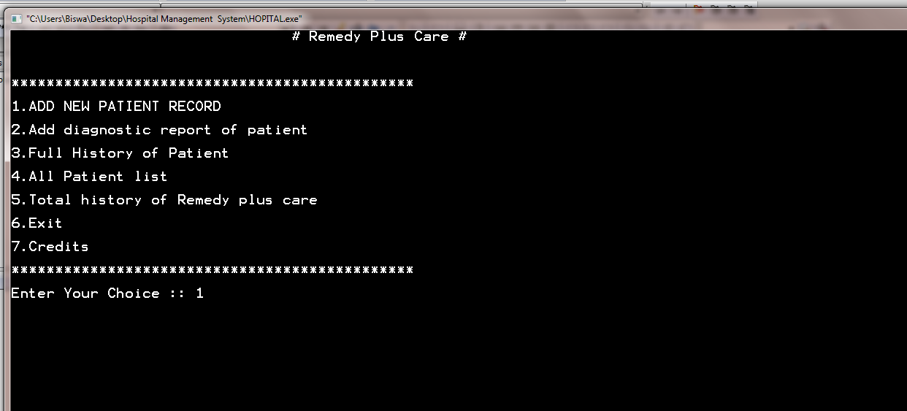</a> 
     
<a href="pics/h20.png">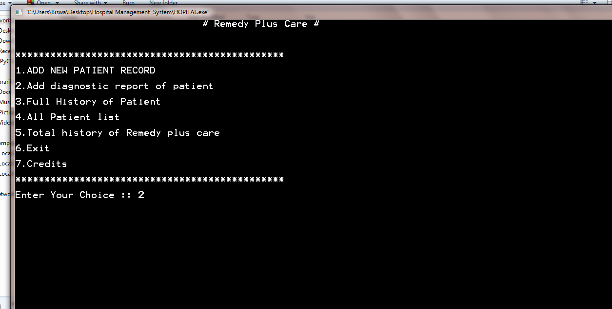</a>

</div>


